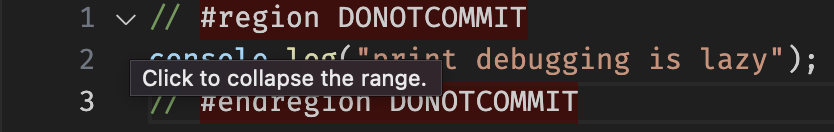

# Git DONOTCOMMIT hook

Checks for `mark DONOTCOMMIT` or `region DONOTCOMMIT`/`endregion DONOTCOMMIT` and fails the commit if those are accidentally staged in the commit.

_Below is an overly detailed README I worked on while blocked on my tasks at work 😅._

## Usage

Once [installed](#install), the hook should run every time you make a commit.

The hook will throw an error if it finds any mention of the following markers in the staged changes:

- `mark DONOTCOMMIT`
- `region DONOTCOMMIT`
- `start DONOTCOMMIT`

It also tries to provide the exact location in the staged file's diff where the markers are found:

```txt
DONOTCOMMIT section found @ (file) (line number)
+ Added line
+
+ mark DONOTCOMMIT
+
```

### Visual Studio Code snippet

With [the VSCode snippets installed](#extra-install-visual-studio-code-snippet), you can quickly add DONOTCOMMIT markers to your code.

The .code-snippet file provides two snippets: inline and region DONOTCOMMIT.

The **inline DONOTCOMMIT** is simple enough, and barely saves you any time.
Just type "DONOTCOMMIT", press `Ctrl + Space` to open up autocomplete, and select the "inline DONOTCOMMIT" snippet. This will simply insert "mark DONOTCOMMIT" into your code.

> [!TIP]
> Personally, I like to use this snippet for entire files (usually placing at the very top of the file).

The **region DONOTCOMMIT** is a bit more complex, and exploits the [Folding/`#region`](https://code.visualstudio.com/docs/editor/codebasics#_folding) feature from VSCode.
Like the inline DONOTCOMMIT snippet, you could also select it by using autocomplete. But the way I like to use it is as follows:

1. Type out the code you don't want to commit.
2. Select it. Make sure to select from the beginning of the first line to the end of the last line.
3. Open the Command Palette (`Ctrl/Cmd + Shift + P`), and search for "Snippet: Surround with Snippet...".
4. Select the "donotcommit" snippet.

Now your code should look like this:

```js
/* #region DONOTCOMMIT */
console.log("print debugging is lazy");
/* #endregion DONOTCOMMIT */
```

By using `#region` and `#endregion` in a comment, VSCode detects these lines and everything in-between as a foldable:



> [!TIP] region DONOTCOMMIT etiquette for changing existing code
> When the code I don't want to commit overrides some code that was already there, what I like to do is comment out the original code, copy it over below, and do the changes there.
> Then, I apply the region DONOTCOMMIT to contain both the original commented out code and the new code.
>
> In the end, it should look something like this:
>
> ```js
> /* #region DONOTCOMMIT */
> // myFunction('foo'); // original code
> myFunction('bar');    // new code
> /* #endregion DONOTCOMMIT */
> ```
>
> My reasoning for doing this is to have a copy of the old code in case I need to reuse some part of it in my new changes.
> I've found that Git's "revert" only works up to line-level, so it falls a bit short of being useful for small per-character changes.

## Install

### Install for new git repositories

1. Configure your [Git template directory](https://git-scm.com/docs/git-init#_template_directory).

    To get it:

    ```sh
    git config init.templatedir
    # or maybe
    echo $GIT_TEMPLATE_DIR
    ```

    or set one if you don't have it:

    ```sh
    git config init.templatedir /path/to/desired/git-template-directory
    # or
    # (add GIT_TEMPLATE_DIR to .bashrc or equivalent file for your shell)
    ```

2. Download the [hooks/](./hooks) directory and place it into your Git template directory.

3. On Linux/MacOS, make sure to mark all files under `hooks/` as executable.

    ```sh
    chmod -R +x /path/to/desired/git-template-directory/hooks
    ```

Done! Now the next time you create or clone a repository, your `.git` directory should have the new pre-commit hook.

### Install for already created/cloned git repository

1. Download all files under [hooks/](./hooks) directory and place them in your `.git/hooks` directory.

    > [!NOTE]
    > If you already had a pre-commit hook with custom settings, you probably want to copy the `./.git/hooks/_find_DONOTCOMMIT.py` line in [hooks/pre-commit](./hooks/pre-commit) into your existing pre-commit file instead of overwriting it.
    >
    > `_find_DONOTCOMMIT.py` is still required, though.

Done! Now next time you make a commit, the DONOTCOMMIT hook should trigger and catch any unwanted files.

### Extra: Install Visual Studio Code snippet

1. Open Visual Studio Code.
2. Open the Command Palette (`Ctrl/Cmd + Shift + P`) and use the "Snippets: Configure Snippets" command.
3. Select "New Global snippets file...".
4. Enter a name for the snippet (e.g. "DONOTCOMMIT").
5. This will open a new file for your snippet. Simply copy the contents of [extra/vscode/DONOTCOMMIT-code-snippets](./extra/vscode/DONOTCOMMIT-code-snippets) into the file.

Done! Now you can use the DONOTCOMMIT snippet by typing "DONOTCOMMIT", triggering autocomplete (`Ctrl + Space`), and selecting either the region or inline snippet.

### Extra: Issues with Husky and other "Git hook managers"

Git hook managers (i.e. Husky) like to overwrite/ignore local hooks by default.

For Husky (which makes git hooks shared for all members of the repository), I usually have to ask to add a few lines that run local hooks from .git/hooks before husky kicks in:

```sh
# At the very top of husky/pre-commit

if [[ -e ./.git/hooks/pre-commit ]]; then
    ./.git/hooks/pre-commit
fi
```
